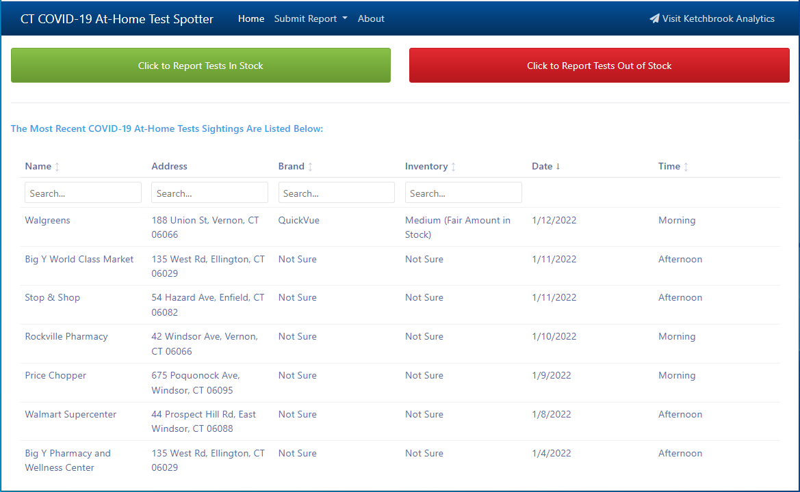
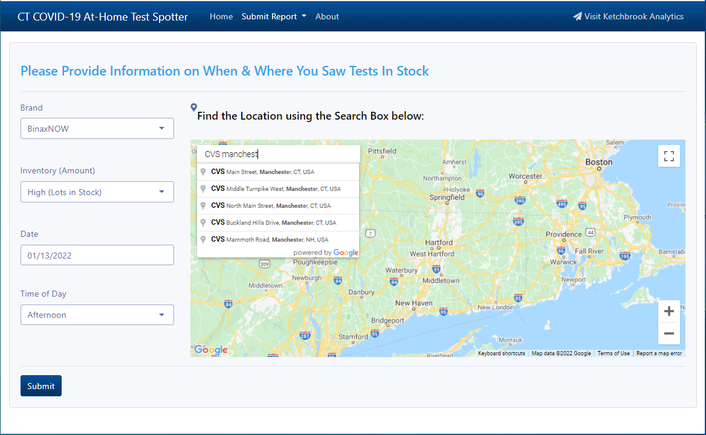
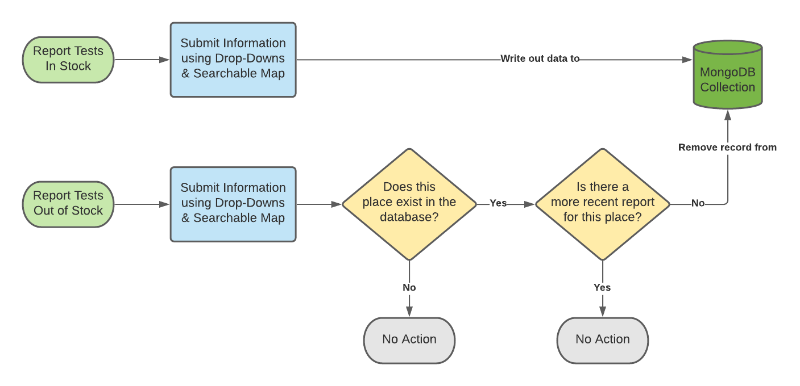

<!-- README.md is generated from README.Rmd. Please edit that file -->

# COVID-19 At-Home Test Spotter

<!-- badges: start -->
<!-- badges: end -->

The goal of the **COVID-19 At-Home Test Spotter** app is to allow users
to locate and report the availability of at-home COVID testing kits at
retail locations in their state.

It works very similar to the [Waze](https://www.waze.com/) app, in that
the “reports” data is entirely user-driven.

The app opens to the “Home” page, which displays the most recently
reported test kits available in retail locations:

When the user clicks either the *green* or *red* buttons at the top of
the page, they are taken to a form prompting them to submit information
about when and where they saw test kits *in* or *out of* stock:

You can see the app live (configured to be limited to Connecticut, USA)
here: <https://ketchbrookanalytics.shinyapps.io/covid_test_spotter/>

## Installation

1.  Clone this repository to your local machine

2.  Open the [covid\_test\_spotter.Rproj](covid_test_spotter.Rproj) file
    from the directory on your local machine where you cloned this
    repository. This should install the {renv} package if you do not
    already have it installed, but if you don’t see that happen in the
    console, run `install.packages("renv")`.

3.  Run `renv::restore()` to install the package dependencies needed to
    run this app successfully

4.  Edit the [global.R](global.R) script as necessary (see
    [below](#configuration))

5.  Open the [app.R](app.R) file and execute the code in that script to
    launch the app

## Configuration

In addition to the code repository, this project requires that you have
certain Google APIs enabled, a MongoDB database setup, and that you have
appropriately edited the [global.R](#global-environment) configuration
file.

### Google APIs

First, you will need to create a new GCP Project. Refer to [this
guide](https://cloud.google.com/resource-manager/docs/creating-managing-projects#creating_a_project)
to see how to quickly set this up.

Once you are in the GCP Project, you can search for the *Maps JavaScript
API* and *Places API* in the search bar at the top of the page. This
will take you to their respective API pages, where you can click the
**Enable** button to enable these APIs in your project.

-   [Maps JavaScript
    API](https://developers.google.com/maps/documentation/javascript/overview),
    for display of the map widget in the UI

-   [Places
    API](https://developers.google.com/maps/documentation/places/web-service/overview),
    for enabling auto-complete in the search box embedded in the map
    widget

After enabling both APIs, you will need to [create an API
Key](https://cloud.google.com/docs/authentication/api-keys#creating_an_api_key)
that we can pass to the {googleway} package for use of these APIs within
our Shiny app. *Note: we highly recommend restricting your API Key to
the specific HTTP referrers or IP addresses where your Shiny app will be
deployed*

### MongoDB Atlas Database

For this project, we chose to use [MongoDB
Atlas](https://www.mongodb.com/atlas/database), which is a NoSQL cloud
database offering. MongoDB provides *shared* clusters at no cost, which
are useful for Proof-of-Concept projects that don’t require high
availability.

To set up a MongoDB Atlas database, using this [Getting Started
Guide](https://docs.atlas.mongodb.com/getting-started/) + *Note that you
will need to ensure that the IP address of where your app lives is
whitelisted by your MongoDB database cluster* \* Create a *config.yml*
YAML file at the **root** of this repository, containing the credentials
for connecting your Shiny app to your MongoDB Atlas database; you can
get your credentials from MongoDB by following [these
instructions](https://docs.atlas.mongodb.com/tutorial/connect-to-your-cluster/#connect-to-your-atlas-cluster),
and an example of what that file should look like can be found in
[examples/config\_example.yml](examples/config_example.yml)

-   (Optional) You may also want to change (or remove) the query results
    limit for the number of items to retrieve from the collection; this
    is set at [db\_connect.R](db_connect.R#L31)

### Global Environment

In the [global.R](global.R) script, you need to set the following
environmental variables:

1.  **GOOGLE\_KEY**, for storing your Google API Key, as discussed
    [here](#google-apis); we accomplished this by placing a plain-text
    file called `google.txt` containing the key string at the root of
    our directory (and added this file to [.gitignore](.gitignore))
2.  **R\_CONFIG\_ACTIVE**, which should always be set to `"default"`
3.  **MONGO\_DB**, the name of the MongoDB Atlas database, as discussed
    [here](#mongodb-atlas-database)
4.  **MONGO\_COLLECTION**, the name of the MongoDB Atlas database
    collection, as discussed [here](#mongodb-atlas-database)

## CRUD Workflow

In the app, the reporting of at-home test kits *in* and *out of* stock
is tied to the execution of CRUD operations against the MongoDB database
back-end. A simple diagram of how this logic (which is coded in the
[db\_connect.R](R/db_connect.R) script) can be seen below:

## Questions?

Contact us at
[info@ketchbrookanalytics.com](mailto:info@ketchbrookanalytics.com?subject=COVID%20Test%20Spotter%20App)
